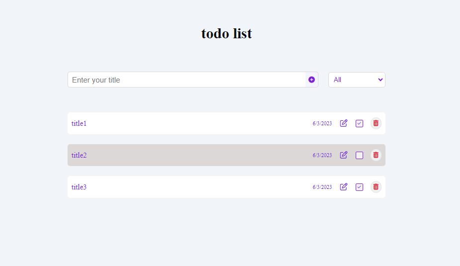
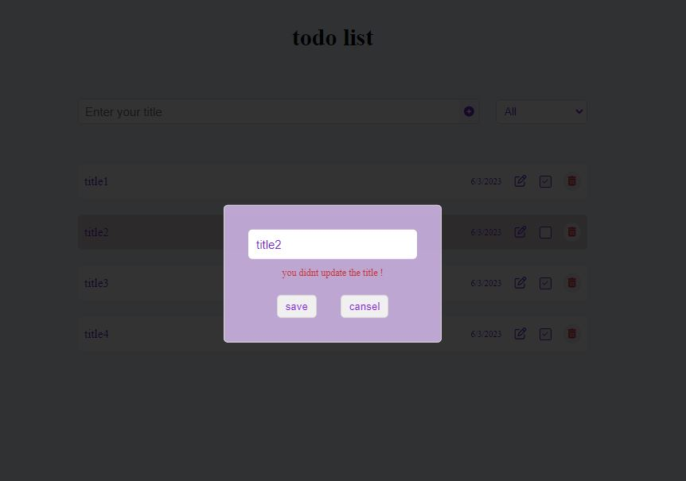

# to-do-list

 This Project is written by Mahsa Tabesh
 
 * You can add new item-todo by clicking on "+" button.  
* You can edit, remove and change state of category in your each item-todo of your list by clicking on.
* You can click on the select-option and choose a state to see  the list of item-todo releted to state.

* Responsive design.  

